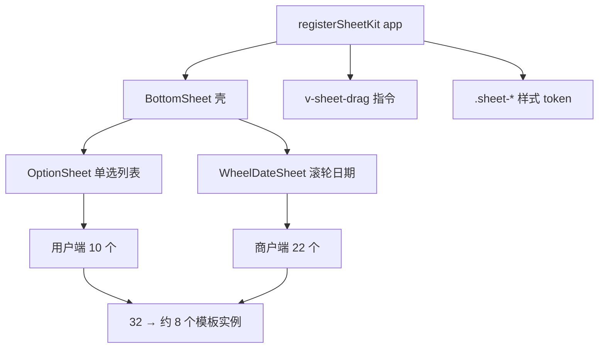

## 需求

对 `index.html`（租赁项目：用户端 + 商户端，共 32 个底部弹窗）执行全项目底部弹窗治理：

1. **产出规范不一致清单**（7 维度：触发方式、弹窗结构、样式规范、动画、交互逻辑、文案格式、组件复用），并给出统一规范（已与用户对齐取值）。
2. **按已确认决策实施组件化改造**：

- 抽公共组件：新增 `BottomSheet` 壳组件与 `OptionSheet` / `WheelDateSheet` 等业务组件，32 个弹窗收敛为约 8 个模板实例；
- `max-height` 默认 **60%**，超出内部滚动；长表单例外（续租方案、支付、退款、支付拆分）可配置更高档位；
- 把手**保留**并实现**下滑关闭**（复用项目已有 swipe-close 手势思路）。

3. 范围：仅 `index.html`；`swap.html` 经检索不含底部弹窗，不在范围。
4. 规范与不一致清单落盘到 `AGENTS.md`「底部弹窗规范」章节，防止后续新增弹窗再次漂移。

## 已确认的统一规范取值

- 遮罩：`rgba(0,0,0,.4)`，`@click.self` 关闭，z = 面板 − 1
- 面板：`absolute bottom-0 left-0 right-0 bg-white rounded-t-[20px] flex flex-col`，`max-height:60%`（默认）/ `lg` 档（长表单），`padding-bottom:max(24px,env(safe-area-inset-bottom))`
- 头部：A 型 = 居中 `17px semibold`（`pt-6 pb-5`）+ 右上角 X；B 型 = `取消 | 居中标题 | 确定`（草稿确认类）
- 列表：`px-4 pb-1 flex flex-col gap-[10px]`；行 `w-full py-3.5 rounded-xl text-center text-[15px]`，未选中 `#F6F7F9`/`#111`，选中 `var(--accent)` 底 + 白字加粗
- 关闭：每个弹窗单一 `closeXxx()` 出口，上下文复位只在出口内做
- z-index 刻度：600（页面浮层）/ 900（业务表单）/ 2000（流程型）/ 2500（全局），面板 = 遮罩 + 1
- 动画：仅 `.fd`（遮罩）+ `.sh`（面板）

## 技术方案

### 架构约束（项目为无构建单文件双 Vue App）

- `index.html` = Vue3 CDN 全局构建 + 模板内联，无构建步骤 → 组件用**全局组件 + template 字符串**实现，不能用 SFC/`<script setup>`。
- 双实例：`mountUser(#mount-user)` / `mountMerchant(#mount-merchant)` 各自 `Vue.createApp` → 在 SHARED CORE 增加 `registerSheetKit(app)`，两端 mount 前调用一次，实现一套组件两端可用。
- **状态 ref 全部保留不变**（`showDocSheet/showRenewPlan/...`），只替换模板为组件调用；`paint()` 的 watch 列表与 `createNav` 的 `_navR` 快照因此不受影响，回归风险最小。

### 新增共享件（SHARED CORE）

| 件 | 职责 |
| --- | --- |
| `registerSheetKit(app)` | 注册组件与指令的统一入口，两端各调用一次 |
| `<BottomSheet>` 壳组件 | 遮罩（fd）+ 面板（sh）+ 把手（下滑关闭）+ 头部 A/B 两型 + 安全区 + 具名插槽 `default/footer`；props：`open`、`title`、`type(A/B)`、`size(sm=60%/lg)`、`maskZ`；emit `close`、`confirm` |
| `<OptionSheet>` | 基于 BottomSheet 的单选列表：`:options`（统一 `{value,label}[]`）、`v-model` 选中、`@select`；承载租赁类型/方案、联系门店、各筛选弹窗 |
| `<WheelDateSheet>` | 合并商户端两个逐字重复的滚轮日期弹窗（消除约 55 行重复）；复用既有 `.track-wheel-*` 样式 |
| `v-sheet-drag` 指令 | 把手/面板向下拖拽超过阈值（约 80px）触发 `close` 回调；参考既有 `v-swipe-close` 的手势实现，两端共用 |
| `.sheet-*` 样式 token | `.sheet-mask/.sheet-panel/.sheet-handle/.sheet-scroll`；合并 `.hide-scroll`/`.hid`/`.conf-scroll-hide` 三套同义类 |

### 迁移策略（分批，每批迁移后立即回归）

- 批次顺序：共享件 → 用户端样板 3 个 → 用户端其余 7 个 → 商户端 11 个 → 商户端滚轮日期合并 → 文档化 → 全量回归。
- 迁移每个弹窗前用 code-explorer 核对该弹窗内部 DOM 结构与绑定（插槽/头部型别/滚动容器/关闭路径），避免漏迁内容。
- 长表单例外（`size="lg"` ≈ 92%）：续租方案(2010)、支付(2090)、退款(5131)、支付拆分(5190)。
- `csSheet`（785 行，`fixed z-[9999]` 居中弹窗，与联系门店同源 `csList` 数据）一并改为 `OptionSheet` 底部弹窗，消除"同数据两种呈现"。

### 性能与风险

- 组件化后模板实例 32 → 约 8，重复 DOM/样式减少；无运行时新增依赖。
- 高风险点：滚轮组件的 `@scroll` 逻辑迁移（需保留 ref 与滚动吸附）、`paint()` 原型面板标注依赖 `data-page-node-id`（组件需透传 attrs）。
- 兜底：组件迁移只动模板与新增共享件，不触碰业务 ref 与 nav 体系；任一批回归失败可单独回滚该批模板。

## Agent Extensions

### SubAgent

- **code-explorer**
- Purpose: 逐个核对 32 个底部弹窗的内部 DOM 结构、绑定、关闭路径与滚动容器，输出迁移清单，避免迁移时漏内容
- Expected outcome: 每个弹窗一张"头部型别/插槽内容/滚动容器/关闭出口"核对表，作为迁移依据

### MCP

- **Playwright MCP Server**
- Purpose: 每批迁移后用 file:// 打开页面做双端回归（注意原型操作面板的 登录状态/押金状态 开关会改变页面形态）
- Expected outcome: 每批 console 0 错误、关键弹窗样式（圆角/遮罩/间距/选中态/60% 封顶与内部滚动）实测通过
---

## 实施记录（2026-09-15）

### 已完成
- `registerSheetKit(app)` 套件进入 `index.html`：`.sheet-*` 令牌（`layer-base`）+ `sheet-drag` 指令 + `bottom-sheet` / `option-sheet` / `wheel-date-sheet` 组件，`mountUser` / `mountMerchant` 各调用一次。
- 样板迁移 3 个：租赁类型 / 租赁方案 → `OptionSheet`，联系门店 → `BottomSheet`；`mask-z` 沿用原层级（2030 / 2590），未动 z-index 体系。
- 规范文档（AGENTS.md §8）已完成，并补齐 8.5 验收、8.6 权威源与构建约束。

### 关键根因（上一轮整体回滚的真实原因）
- `v-sheet-drag="$emit('close')" 是**内联表达式**，每次渲染立即执行 → 弹窗打开即被自身关闭（DOM 看到面板停在 `sh-leave-active`）。修正为 `v-sheet-drag="()=>$emit('close')"` 后，打开/选中/X/下滑四项交互全部实测通过。
- 上一轮判为"挂载失败"是**假阴性**：`vue.global.prod.js` 下 `app._instance` 与 `el.__vue_app__` 均不存在（dev-only），探针恒返回 `hasApp:false`。诊断应捕获 `app.mount(root)` 返回值。
- 结论：`app.directive` 内联表达式陷阱 + 生产构建诊断陷阱，才是那次回滚的原因；组件方案本身无结构性问题。

### 范围修正（后续批次按此执行）
- **z-index / 遮罩取值不做归一**：现有 234 处 `z-[…]`、约 80 种取值，且页面栈占用 500/510/600；归一需先出全层级顺序表，单独立轮。`mask-z` 沿用原层级。
- **csSheet 不改版式**：它是 `fixed z-[9999]` 的三列行（remark/phone/code + 关闭按钮），与 OptionSheet 的居中单行规范冲突；改造属交互变更，需先决策。
- **swap.html 不在本轮范围**：其 4 个底部弹窗（`areaSheet` / `planDetail` / `showIdPicker` / `showIdAction`）待「字符串模板 → in-DOM HTML」迁移完成后按同一套件处理。
- 待迁移仍为 30 个手写弹窗；下一步只迁"纯单选文字列表"型（预计 5-8 个），其余仅套壳。

### 验证方式（可复用）
- 打开 `file:///E:/test/yadea-rental-merge/index.html`（headless Chromium 即可），用 `.sheet-root` 存在判断组件已注册；四项交互实测；控制台 0 错误（仅 1 条与页面无关的 favicon 404）。

---

## 进展记录（2026-09-15）

- **壳层 100% 收敛**：`index.html` 33 个底部弹窗全部改为 `<bottom-sheet>` ×31 + `<option-sheet>` ×2，手写 `rounded-t-[20px]` 面板计数为 0；`WheelDateSheet` 已删除，滚轮/日期类统一用 `BottomSheet type="B"`。
- **内容行 token 第一批**：`.sheet-search`（6 处搜索框，替换前后 computed style 逐项一致：`margin:0 20px 12px` / `padding:10px 16px` / 面板宽 369 时实测 329×42）、`.sheet-body`（7 处带隐藏滚动条类的内容滚动区，等价替代 `flex-1 overflow-y-auto [min-h-0]` + `hid`/`hide-scroll`/`conf-scroll-hide`）；`v-sheet-drag` 滚动守卫补 `.sheet-body`。
- **未纳入**：10 处无 hide 类的滚动容器（当前显示滚动条，归一属可见变化）、`.sheet-chip` / `.sheet-row-danger`、z-index 刻度化、高度三档化、`swap.html` 的 4 个弹窗。
- 规范与坑位已同步到 `AGENTS.md` §8.7（含 UnoCSS 运行时按需生成导致的"类没生效"假象）。
- **修复「车辆详情 → 用户详情 → 返回落到首页」**（2026-09-15）：商户端 `setTab()` 内部无条件 `navReset()`，而 `goVehicleDetail` / `goBatteryDetail` / `goUserDetail` 是「先 `navOpen()` 压来源快照 → `setTab(目标 Tab)` → 打开目标页」的顺序，刚压入的那层被自己清掉，目标页成了栈空页；`navBack()` 走边界兜底恢复 `_rootSnap`（首页）。日志证据：`push → (未命名)` / `push veh:detail` 之后紧跟 `reset 清空2层 → (首页)`。修法：`setTab(t, keepStack)` 只在手动切 Tab 时清栈，三处跨 Tab 跳转传 `true`；顺带把 `goUserDetail` 的 `if(!account)return` 提到 `navOpen()` 之前（避免空 account 压入幽灵层）。实测：日志变为 `push` 两层后 `back veh:detail` 只弹一层，页面回到「车辆详情」。已写入 `AGENTS.md` §9 页面栈导航。
- **修复「绑定用户」弹窗在商户端首页自开**（2026-09-15）：根因是组件的 `open:Boolean` +  `userPickActive = ref('')`——Vue 的布尔属性转换把空字符串 `''` 变成 `true`（实测 3.5.42，`[Boolean,String]` 也照样转），窗口在空值即打开、且关闭出口置回 `''` 后仍为真所以 X 点不动；`uWalletSheet = ref('')` 同理（钱包页）。两个壳的 `open` 已改为无类型 + `default:false`，布尔/字符串/空值三类语义与手写 `v-if` 一致；实测空态 0 弹窗、`'vehicle'` 可开、置空即关、`showDatePicker` 布尔开关不受影响。已写入 `AGENTS.md` §8.3 陷阱 + §8.6 空态自检第 4 项。

<!-- progress:2026-09-15 -->
