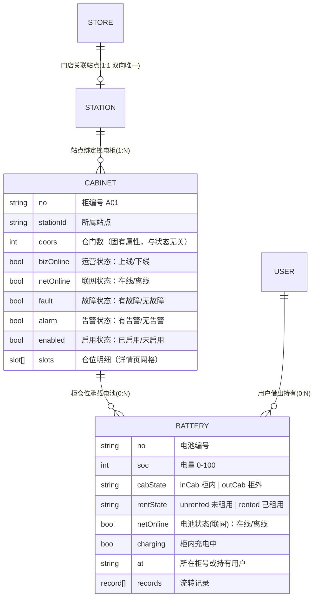

# 换电商户端功能规划

## 产品概述

在换电系统商户端（`swap.html`）基础上补齐核心业务，底部 Tab 固定四项：**首页、换电柜、电池、我的**。围绕门店、站点、换电柜、电池四大对象建立管理与流转体系。

## 核心功能

- **领域关系**：换电柜绑定在站点上；**门店仅可关联一个站点（1:1 双向唯一）**；电池在「换电柜」与「用户」间流动。
- **机柜 7 维状态**（依据用户提供的机柜列表截图）：运营状态（上线/下线）、联网状态（在线/离线）、仓门数（**机柜固有属性，数值，与状态无关**）、电池数量（数值）、故障状态（无故障/有故障）、告警状态（无告警/有告警）、启用状态（已启用/未启用）。
- **电池 3 维状态**（依据用户提供的电池列表截图）：在柜状态（柜内/柜外）、租用状态（未租用/已租用）、电池状态（在线/离线，即截图顶部筛选的「联网状态」）。
- **筛选分层（快捷只留 1 个维度，其余入筛选弹窗，二者不重复）**：
- 机柜列表快捷 = **运营状态**（全部/上线/下线）；筛选弹窗收纳站点、联网状态、故障状态、告警状态、启用状态。
- 电池列表快捷 = **在柜状态**（全部/柜内/柜外）；筛选弹窗收纳电池状态（在线/离线）、租用状态（未租用/已租用）。
- **首页工作台**：深蓝渐变 Hero 卡（今日换电次数、今日营收、柜在线率）+ 指标卡（门店/站点/柜/电池数）+ 快捷入口宫格（门店管理、站点管理、数据看板）+ 设备告警列表（红/橙状态点）。
- **换电柜 Tab**：顶部运营状态 chips + 「筛选」按钮（漏斗图标，有已选条件时显示角标）；柜卡片以状态标签矩阵呈现各维度（柜号 + 所属站点 + 运营状态；仓门数/电池数量两个数值；联网/故障/告警/启用状态点），点击进柜详情。
- **柜详情**：基本信息卡逐项展示 7 维状态 + 仓位网格（空闲/有电池/故障三态着色）+ 底部远程操作按钮（远程开仓、上下线、故障与告警切换演示，触发 `confirm-dialog`）。
- **电池 Tab**：顶部在柜状态 chips + 「筛选」按钮；电池卡片展示三维状态色标（在柜 / 租用 / 电池状态）+ SOC 环形小图；详情页 SOC 大环形 + 三行状态卡 + 基本信息（编号/循环次数/健康度）+ 流转记录时间线；借出/归还演示联动刷新柜仓位与电池状态。
- **我的 Tab**：用户信息卡 + 常用功能菜单（门店管理、站点管理、数据看板）+ 个人信息/系统设置入口（与租车系统 `index.html` 商户端一致，现状已一致仅回归）。
- **数据看板（二级页）**：近 7 日换电趋势 CSS 柱状图、机柜各维状态分布、电池 3 维状态分布、告警统计（纯 CSS/SVG）。
- **门店管理（二级页）**：门店列表、门店详情（唯一关联站点卡，未关联显示提示）、新增/编辑门店（关联站点单选，已被其他门店占用的站点禁用并提示）。
- **站点管理（二级页）**：站点列表（按门店筛选）、站点详情（所属门店 + 绑定柜列表）、新增/编辑站点（绑定门店单选，已被其他站点占用的门店禁用）、为站点绑定换电柜。

## 视觉

延续换电系统视觉语言：浅灰底 + 白色圆角卡片 + 深蓝 accent 渐变，状态一律用色点/色标区分，避免大色块，专业商务质感。

状态色标统一：

- 机柜：上线 / 在线 / 无故障 / 无告警 / 已启用 = 绿 `#16A34A`；下线 / 离线 = 红 `#DC2626`；有故障 / 有告警 = 橙 `#FF8A00`；未启用 = 灰 `#999999`。
- 电池（依据截图：柜外=橙、未租用=橙、离线=红）：在线 = 绿 `#16A34A`、离线 = 红 `#DC2626`；柜内 = 绿 `#16A34A`、柜外 = 橙 `#FF8A00`；已租用 = 绿 `#16A34A`、未租用 = 橙 `#FF8A00`（绿=正常在柜/在租，橙=待关注，红=离线异常）。

## 技术栈

- 不引入任何新依赖，沿用 `swap.html` 现有单文件 in-DOM 模板 + CDN Vue3 生产构建 + UnoCSS 运行时。
- 复用 `registerSheetKit` 共享组件：`page` / `nav-bar` / `bottom-sheet` / `option-sheet` / `confirm-dialog` / `empty-state` / `tab-bar` / `loading-overlay`，图标走 `luci()`。
- 复用 `createNav` 快照式页面栈（先 `navOpen()` 再改状态、返回 `navBack()`、保存成功 `navDrop()`+置空）与 `authState()` 工厂。
- 文案走现有内联中文（`locales/swap/*.json` 为空占位，校验脚本自动跳过）。

## 领域模型



- mock：`M_STORES`（id/name/addr/phone/hours/**stationId 单值**）、`M_STATIONS`（id/name/addr/storeId/cabNos）、`M_CABINETS`（no/stationId/model/**doors 固有数值**/**bizOnline/netOnline/fault/alarm/enabled**/slots[]）、`M_BATTERIES`（no/soc/cycles/health/**cabState/rentState/netOnline/charging**/at/records[]）。
- 机柜派生：`doors` 为 mock 固有字段直接展示（与状态无关，不显示 `--`）；`battCount = slots.filter(occupied).length`（柜内电池数）。
- 电池合法组合：柜内+未租用（柜内闲置 `charging=false`；充电中 `charging=true`）、柜外+已租用（已租出）、柜外+未租用（维修/故障）。
- 电池状态维度色标（截图一致）：`cabState` 柜外=橙/柜内=绿；`rentState` 未租用=橙/已租用=绿；`netOnline` 离线=红/在线=绿。
- 电池联动：借出 = 柜仓位置空 + `cabState=outCab` + `rentState=rented` + at=用户 + 追加记录；归还 = 仓位占用 + `cabState=inCab` + `rentState=unrented` + charging 按 SOC 置位 + at=柜号 + 追加记录。

## 筛选设计（快捷 chips + 筛选弹窗）

- 两者共享同一份筛选状态对象（如 `cabFilter = { bizState, stationId, netState, fault, alarm, enabled }`、`battFilter = { cabState, battNet, rentState }`），快捷 chips 只是常用维度的直接入口，弹窗是完整面板；关闭弹窗后 chips 高亮与弹窗选项保持同步。
- 快捷维度：机柜仅运营状态；电池仅在柜状态。
- 筛选弹窗统一用 `bottom-sheet`（B 型：取消 ｜ 筛选 ｜ 确定），面板内每个维度为一组标题 + 一组 chips/选项行；底部提供「重置」与「确定」，仅点「确定」才写回生效（取消不改动），并用 `computed` 统计已生效的筛选维度数用于「筛选」按钮角标。
- 列表空态用 `empty-state`，并给出「清空筛选」引导。
- 弹窗维度：机柜 = 站点 / 联网状态 / 故障状态 / 告警状态 / 启用状态（5 组）；电池 = 电池状态 / 租用状态（2 组）。

## 实现要点

- **Tab 调整**（1714 行）：`board 看板` → `mine 我的`（icon `user`）；原「我的头部」块（1704-1712）条件改为 `tab==='mine'&&!profileOV&&!profileSub`，并在其后补「常用功能」菜单组；个人信息/系统设置及次级页（1883-1998）原样保留。
- 商户端 setup（3049-3058 行）扩展业务状态（stores/stations/cabinets/batteries/筛选与详情状态），页面级 ref 经 `auth.addNavRefs([...])` 注册；数据类 ref 不得注册。
- 业务二级页走「navOpen('名') → 改状态」模式（与用户端 app 级页面一致），不进 NAV_SCREENS。
- 柜/电池/门店/站点的筛选与统计全部 `computed` 派生；mock 数据量小无需虚拟滚动；看板图表纯 CSS/SVG。
- 所有页面遵守 AGENTS.md 铁律：kebab-case、显式闭合、`open` prop 只声明 `{default:false}`、自定义指令传函数、`page` 壳 + `nav-bar` 头（标题居中三规则）、隐藏滚动条 `hide-scroll/.hid`、空态 `empty-state`、确认 `confirm-dialog`、选项 `option-sheet`。
- demo-ops 面板（1999-2014 区域）为各业务页增加演示按钮（电池借出/归还、机柜上/下线、故障与告警切换），沿用 `sideSetup` 模式。

## 目录结构

单文件项目，仅修改 `swap.html` 一处（[MODIFY]），分块追加：

```
e:/test/yadea-rental-merge/
└── swap.html                    # [MODIFY] 唯一改动文件，分块追加：
                                 #   ① 1701-1714：我的 Tab 条件与常用功能菜单组
                                 #   ② 1714 行：tab-bar items 改 board→mine
                                 #   ③ 新增区块：首页工作台/换电柜 Tab/电池 Tab 模板
                                 #   ④ 新增区块：柜详情/电池详情/数据看板/门店管理/站点管理二级页模板
                                 #   ⑤ setup（3049-3058）：业务状态、mock 数据、computed 与联动函数
                                 #   ⑥ 1999-2014：demo-ops 演示按钮扩充
```

## 关键数据结构

机柜 7 维与电池 3 维对象，筛选状态，及联动接口（其余为常规 computed/筛选，不做枚举）：

```js
// 机柜：固有属性 + 7 维状态
{ no, stationId, model,
  doors: 12,         // 仓门数（固有属性，与状态无关）
  bizOnline: true,   // 运营状态 上线/下线
  netOnline: true,   // 联网状态 在线/离线
  fault: false,      // 故障状态 有故障/无故障
  alarm: false,      // 告警状态 有告警/无告警
  enabled: true,     // 启用状态 已启用/未启用
  slots: [{ no, occupied, fault }] } // 仓位明细（详情页网格）；battCount 由 occupied 计数

// 电池：3 维状态
{ no, soc, cycles, health,
  cabState: 'inCab'|'outCab',      // 在柜状态 柜内/柜外
  rentState: 'unrented'|'rented',  // 租用状态 未租用/已租用
  netOnline: true,                 // 电池状态(联网) 在线/离线
  charging: Boolean,               // 柜内充电中
  at: '',                          // 所在柜号 or 持有用户
  records: [{ time, type, note }] } // 流转记录

// 筛选状态（快捷 chips 与弹窗共享）
cabFilter  = { bizState:'', stationId:'', netState:'', fault:'', alarm:'', enabled:'' }
battFilter = { cabState:'', battNet:'', rentState:'' }

// 借出 / 归还联动（返回 toast 文案）
function merchantBorrow(battNo) {}   // 仓位清空 + outCab + rented + 追加记录
function merchantReturn(battNo) {}   // 仓位占用 + inCab + unrented + 追加记录
```

```js
// 门店/站点 1:1 约束
// 门店编辑选站点：stationId 已被其他门店占用则禁用并提示「已被 xx 门店关联」
// 站点编辑选门店：storeId 已被其他站点占用则禁用并提示
```

## 验证

- 提交前自检（AGENTS.md §6）：内联脚本 `new Function`、标签配平、挂载冒烟 `.sheet-root` 数量、逐页交互与控制台 0 错误。
- 回归：我的 Tab 个人信息/系统设置及全部次级页面不损坏；双端（用户端+商户端）正常挂载。

## 设计风格

延续换电系统现有视觉语言（浅灰底 `#F6F7F9` + 白色圆角卡片 + 深蓝 accent `#2B3F5F`→`#22324A` 渐变），商户端整体呈现专业、现代、信息密度适中的商务质感。状态一律用色点/色标区分，避免大色块。

## 页面布局（6 屏：4 Tab + 2 类二级页）

1. **首页工作台**：顶部深蓝渐变 Hero 卡（今日换电次数/营收/在线率，白色大数字 + 半透明白图标），下方指标卡横排（门店/站点/柜/电池数），快捷入口 3 宫格（图标圆底 + 文字），设备告警列表用红/橙状态点 + 告警类型与时间。
2. **换电柜列表**：顶部 sticky 筛选区一行 —— 运营状态 chips（全部/上线/下线）+ 右侧「筛选」按钮（漏斗 + 已选数角标）。柜卡片顶部为柜号 + 所属站点 + 「上线/下线」色点标签，中部一行两个数值（仓门数、电池数量），底部一行四个状态点（联网、故障、告警、启用），点击进柜详情。
3. **柜详情**：`nav-bar` 返回 + 基本信息白卡（编号/站点/型号 + 7 维状态逐项：运营、联网、仓门数、电池数量、故障、告警、启用，每项左侧色点右侧文案）+ 仓位网格（空闲描边/有电池深蓝实底/故障红）+ 底部固定操作按钮（远程开仓、上下线、故障与告警切换，触发 `confirm-dialog`）。
4. **电池列表**：顶部 sticky 筛选区 —— 在柜状态 chips（全部/柜内/柜外）+ 右侧「筛选」按钮。电池卡片含 SOC 环形小图（conic-gradient，色随电量）、三行状态（在柜状态点 / 租用状态点 / 电池状态点）与所在位置。
5. **电池详情**：SOC 大环形图 + 三行状态卡（在柜 / 租用 / 电池状态，各带独立色点）+ 基本信息（编号/循环次数/健康度）+ 流转记录时间线（借出/归还/充电图标 + 时间）。
6. **数据看板**：统计概览行 + 近 7 日换电趋势 CSS 柱状图（渐变柱 + 数值）+ 机柜状态/电池 3 维状态分布环形图 + 告警统计列表。

门店管理/站点管理二级页：列表页（搜索 + 新增按钮）+ 详情页（信息卡 + 唯一关联站点/绑定柜列表 + 新增/编辑弹窗，用 `bottom-sheet` B 型表单）。

## 交互

- 列表页顶部 sticky 筛选区 + 滚动列表，卡片按压 `active:bg-[#F6F7F9]`；详情页操作按钮固定底部安全区；空态统一 `empty-state`（含清空筛选引导）；筛选弹窗与新增/编辑表单用 `bottom-sheet`（B 型），沿用 `form-card/form-row/login-field` token；电池借出/归还、机柜状态切换通过 demo-ops 面板触发并 toast 反馈。

## Agent Extensions

### MCP

- **Playwright MCP Server**
- 用途：实现完成后逐页打开商户端 4 个 Tab 与全部二级页，验证渲染、交互（含筛选弹窗生效/重置/角标同步）、控制台 0 错误，并回归「我的」个人信息/系统设置及次级页面不损坏。
- 预期产出：6 屏页面交互全链路验证通过，快捷筛选与弹窗筛选联动正确，demo-ops 演示按钮（电池借出/归还、机柜上下线/故障/告警切换）联动正确，双端挂载正常。

### Skill

- **frontend-design**
- 用途：指导首页工作台、数据看板、列表与详情页的视觉延续与细节设计，避免模板化观感，与现有换电系统视觉语言保持一致。
- 预期产出：层次清晰、符合换电系统现有视觉语言的商户端 UI。