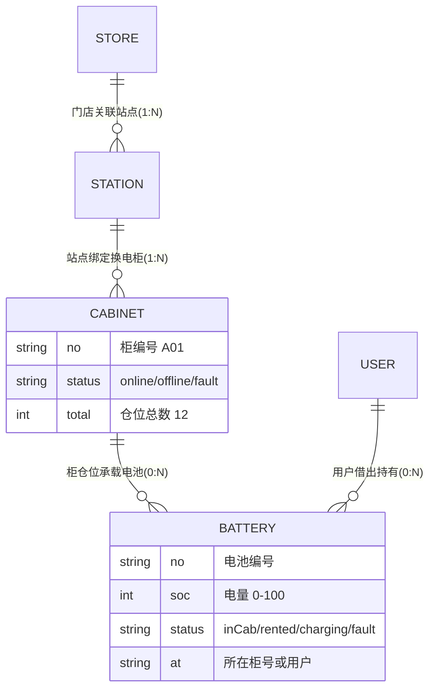

## 产品概述

在换电系统商户端（`swap.html`）基础上，按市面上主流换电商户端（哈啰/铁塔/e换电/雅迪/比特安）形态补齐核心业务，底部 Tab 固定为四个：**首页、换电柜、电池、我的**。围绕门店、站点、换电柜、电池四大对象建立完整的管理与流转体系。

## 核心功能

- **领域关系**：换电柜绑定在站点上；门店可关联一个或多个站点；电池在「换电柜」与「用户」之间流动（在柜/借出/充电中/故障/归还）。
- **首页工作台**：经营概览（门店数/站点数/柜数/电池数/在线率）、今日换电次数与营收、设备告警列表、快捷入口（门店管理、站点管理、数据看板）。
- **换电柜 Tab**：按站点/状态筛选柜列表，柜详情展示基本信息、仓位电池分布与远程操作（开仓/下线等演示），所有换电柜归属站点。
- **电池 Tab**：按状态筛选电池列表，电池详情展示 SOC、健康度、循环次数、当前所在柜或持有用户及流转记录；借出/归还演示联动刷新柜仓位与电池状态。
- **我的 Tab**：顶部用户信息卡 + 「常用功能」菜单组（门店管理、站点管理、数据看板）+ 个人信息/系统设置入口。
- **数据看板（二级页）**：近 7 日换电趋势柱状、柜状态分布、电池状态分布、告警统计（纯 CSS/SVG）。
- **门店管理（二级页）**：门店列表、门店详情（展示关联站点）、新增/编辑门店、选择关联站点。
- **站点管理（二级页）**：站点列表（按门店筛选）、站点详情（所属门店、绑定柜列表）、新增/编辑站点、为站点绑定换电柜。
- **「我的」个人信息与系统设置及其全部次级页面**：与租车系统 `index.html` 商户端保持一致（现状已一致，仅回归不重做）。

## 技术栈

- 不引入任何新依赖，沿用 `swap.html` 现有单文件 in-DOM 模板 + CDN Vue3 生产构建 + UnoCSS 运行时。
- 复用 `registerSheetKit` 共享组件：`page` / `nav-bar` / `bottom-sheet` / `option-sheet` / `confirm-dialog` / `empty-state` / `tab-bar` / `loading-overlay`，图标走 `luci()`。
- 复用 `createNav` 快照式页面栈（先 `navOpen()` 再改状态、返回 `navBack()`、保存成功 `navDrop()`+置空）与 `authState()` 工厂。
- 文案走现有内联中文（`locales/swap/*.json` 为空占位，校验脚本自动跳过）。

## 领域模型

- 商户端新增 mock：`M_STORES`（id/name/addr/phone/hours/stationIds）、`M_STATIONS`（name/addr/storeId/cabIds）、`M_CABINETS`（no/stationId/status/total/slots[]）、`M_BATTERIES`（no/soc/cycles/health/status/at/records[]）。
- 电池流转：借出 = 柜 slots 对应仓位置空 + 电池 status→`rented` 且 at=用户；归还 = 仓位占位 + status→`charging/inCab`；与用户端 `confirmBorrow/confirmReturn` 语义一致（商户端独立 mock，不强求跨端实时同步）。

## 实现要点

- 商户端 setup（3049-3058 行）扩展业务状态（stores/stations/cabinets/batteries/筛选与详情状态），页面级 ref 经 `auth.addNavRefs([...])` 注册（tab 已在其中）；数据类 ref 不得注册。
- **Tab 调整**（1714 行）：`board 看板` → `mine 我的`（icon `user`）；原「我的头部」块（1704-1712）改为 `tab==='mine'&&!profileOV&&!profileSub` 条件下渲染，并新增「常用功能」菜单组。
- 业务二级页走「navOpen('名') → 改状态」模式（与用户端 app 级页面一致），不进 NAV_SCREENS；新增页面需能落到 screen 或紧随状态赋值。
- 所有页面遵守铁律：kebab-case、显式闭合、`page` 壳 + `nav-bar` 头（标题居中三规则）、`open` prop 默认 false、隐藏滚动条 `hide-scroll/.hid`、空态 `empty-state`、确认 `confirm-dialog`、选项 `option-sheet`。
- 过滤/统计全部用 `computed` 派生；mock 数据量小，无需虚拟滚动；看板图表纯 CSS/SVG。
- demo-ops 面板为各业务页增加演示按钮（电池借出/归还、柜故障切换），沿用 `sideSetup` 模式。

## 设计风格

延续换电系统现有视觉语言（浅灰底 #F6F7F9 + 白色圆角卡片 + 深蓝 accent #2B3F5F），商户端整体呈现专业、现代、信息密度适中的商务质感。

## 页面规划（6 屏：4 Tab + 2 类二级页）

1. 首页工作台：顶部深蓝渐变 Hero 卡（今日换电次数、今日营收、柜在线率）+ 三张指标卡（门店/站点/柜/电池数）+ 快捷入口宫格（门店管理、站点管理、数据看板）+ 设备告警列表（红/橙状态点）。
2. 换电柜列表：顶部站点横向筛选 chips + 柜卡片列表（柜号、所属站点、在线/离线/故障状态色点、占用数/总数进度条），点击进柜详情。
3. 柜详情：基本信息卡（编号/站点/状态/总仓位）+ 仓位网格（12 格，空闲/有电池/故障三态着色）+ 底部远程操作按钮（开仓、下线维护，触发 confirm-dialog）。
4. 电池列表：状态筛选 chips（在柜/借出/充电中/故障）+ 电池卡片（编号、SOC 环形小图、所在柜或用户、状态色标）。
5. 电池详情：SOC 大环形图 + 状态卡 + 基本信息（编号/循环次数/健康度）+ 流转记录时间线（借出/归还/充电）。
6. 数据看板：统计概览行 + 近 7 日换电趋势 CSS 柱状图 + 柜/电池状态分布环形图 + 告警统计列表。

门店管理/站点管理二级页：列表页（搜索 + 新增按钮）+ 详情页（信息卡 + 关联站点/绑定柜列表 + 新增/编辑弹窗，用 bottom-sheet B 型表单）。

## 交互与布局

- 列表页顶部 sticky 筛选区 + 滚动列表，卡片按压 `active:bg-[#F6F7F9]`。
- 详情页 `nav-bar` 返回 + 分组白卡（`rounded-xl` + 1px #E5E5E5 边框），操作按钮固定底部安全区。
- 空态统一 `empty-state`；表单沿用 `form-card/form-row/login-field` token；SOC 用 conic-gradient 环形。

## MCP

- **Playwright MCP Server**
- 用途：实现完成后逐页打开商户端 4 个 Tab 与全部二级页，验证渲染、交互、控制台 0 错误，回归「我的」个人信息/系统设置不损坏。
- 预期产出：全链路交互验证通过，demo-ops 演示按钮（电池借出/归还、柜故障）联动正确。

## Skill

- **frontend-design**
- 用途：指导首页工作台、看板、列表与详情页的视觉延续与细节设计，避免模板化观感。
- 预期产出：与现有换电系统视觉语言一致且层次清晰的商户端 UI。