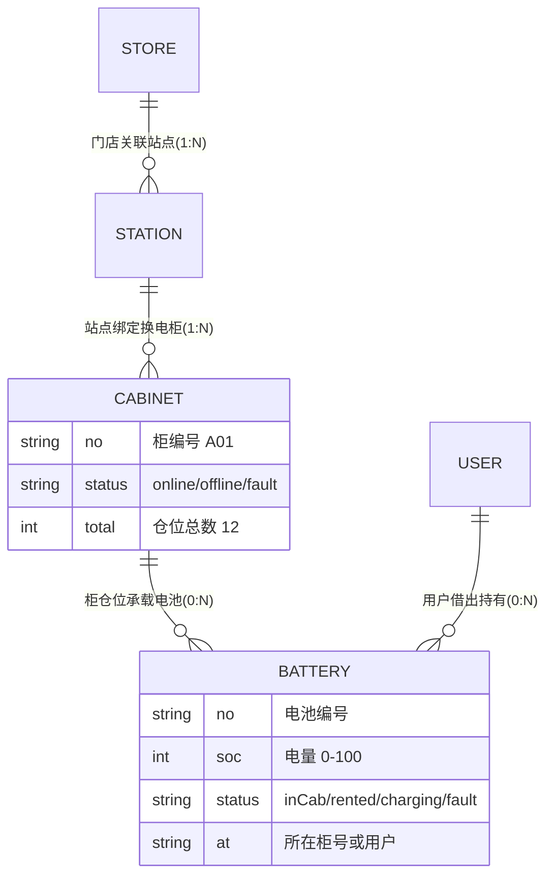

## 产品概述

在现有换电系统 `swap.html` 商户端（已具备登录、我的、个人信息、系统设置及其全部次级页面）基础上，补齐四大业务功能：门店、站点、换电柜、电池。页面形态借鉴市面上主流换电商户端（哈啰、铁塔、e换电、雅迪等），保持现有 4 个底部 Tab（首页 / 换电柜 / 电池 / 看板）结构不变。

## 核心功能

- 领域关系：换电柜绑定在站点上；门店可关联一个或多个站点；电池在「换电柜」与「用户」之间流转（在柜 / 借出 / 充电中 / 故障 / 归还）。
- 首页工作台：经营概览（站点数、柜数、电池数、在线率）、今日换电次数与营收、设备告警列表、快捷入口（门店管理、站点管理）。
- 换电柜管理：按站点/状态筛选的柜列表、柜详情（基本信息、仓位与电池分布、远程开仓/下线等演示操作）。
- 电池管理：按状态筛选的电池列表、电池详情（SOC、健康度、循环次数、当前所在柜或持有用户、流转记录），支持借出/归还的演示联动（同步更新柜仓位与电池状态）。
- 数据看板：换电趋势（近 7 日柱状）、设备状态分布（柜在线/离线/故障占比）、电池状态分布与告警统计。
- 门店管理：门店列表、门店详情（展示关联站点）、新增/编辑门店、选择关联站点。
- 站点管理：站点列表（按门店筛选）、站点详情（所属门店、绑定柜列表）、新增/编辑站点、为站点绑定换电柜。
- 「我的」页面：个人信息与系统设置及其全部次级页面与租车系统 `index.html` 商户端保持一致（现状已一致，规划中只做不回归核查，不重做）。

## 技术栈

- 不引入任何新依赖，完全沿用 `swap.html` 现有单文件 in-DOM 模板 + CDN Vue3 生产构建 + UnoCSS 运行时。
- 复用 `registerSheetKit` 共享组件：`page` / `nav-bar` / `bottom-sheet` / `option-sheet` / `confirm-dialog` / `empty-state` / `tab-bar` / `loading-overlay`，图标走 `luci()`。
- 复用 `createNav` 快照式页面栈（先 `navOpen()` 再改状态、返回 `navBack()`、保存成功 `navDrop()`+置空）与 `authState()` 工厂。
- 文案走现有内联中文（`locales/swap/*.json` 为空占位，校验脚本自动跳过，无需维护 i18n）。

## 领域模型（对齐用户端数据并扩展）

- 商户端新增 mock 数据：`M_STORES`（id/name/addr/phone/hours/stationIds）、`M_STATIONS`（在用户端 `stations` 基础上加 `storeId/cabStatus`）、`M_CABINETS`（no/stationId/status/total/slots 数组）、`M_BATTERIES`（no/soc/cycles/health/status/at/records 流转记录）。
- 电池流转演示：借出 = 柜 slots 对应仓位置空 + 电池 status→`rented` 且 at=用户；归还 = 仓位占位 + status→`charging/inCab`；与用户端 `confirmBorrow/confirmReturn` 的业务语义一致（商户端为独立 mock 演示，不强求跨端实时同步）。

## 实现要点

- 商户端 setup（3049-3058 行）扩展业务状态（stores/stations/cabinets/batteries/筛选与详情状态），并 `auth.addNavRefs([...])` 注册页面级 ref（tab 已在其中）；新增页面在 `NAV_SCREENS` 与 `nameOf()` 登记（AGENTS.md §4）。
- 所有页面遵守铁律：kebab-case 组件、显式闭合、`page` 壳 + `nav-bar` 头、`open` prop 默认 false、隐藏滚动条 `hide-scroll/.hid`、列表空态用 `empty-state`、操作确认用 `confirm-dialog`、选项选择用 `option-sheet`。
- 过滤/统计全部用 `computed` 派生，避免在模板内联计算；mock 数据量小（几十条），无需虚拟滚动。
- 看板图表用纯 CSS/SVG 条形与环形实现，不引入图表库。
- demo-ops 面板为各 Tab 增加演示按钮（如电池借出/归还、柜故障切换），沿用现有 `sideSetup` 模式。

## 设计风格

延续换电系统现有视觉语言（浅灰底 + 白色圆角卡片 + 深蓝 accent），在此基础上做商户端业务页的完整设计，整体现代、专业、信息密度适中。

## 页面规划（共 6 屏，全部在现有 4 Tab 与两级业务页内）

1. 首页工作台：顶部深蓝渐变 Hero 卡（今日换电次数、今日营收、在线率）+ 三张指标卡（站点/柜/电池数）+ 快捷入口宫格（门店管理、站点管理）+ 设备告警列表（红/橙状态点）。
2. 换电柜列表：顶部按站点横向筛选 chips + 状态色条卡片列表（柜号、所属站点、在线/离线/故障、占用数/总数），点击进柜详情。
3. 柜详情：基本信息卡（编号/站点/状态/仓位）、仓位网格（12 格，空闲/有电池/故障三态着色）、操作按钮（远程开仓、下线维护，触发 confirm-dialog）。
4. 电池列表：顶部状态筛选 chips（在柜/借出/充电中/故障）+ 电池卡片（编号、SOC 环形小图、当前所在柜或用户、状态色标）。
5. 电池详情：SOC 大环形图 + 状态卡 + 基本信息（编号/循环次数/健康度）+ 流转记录时间线（借出/归还/充电）。
6. 数据看板：统计概览行 + 近 7 日换电趋势 CSS 柱状图 + 柜状态分布环形图 + 电池状态分布 + 告警统计列表。

## 交互与布局

- 列表页：顶部 sticky 筛选区 + 滚动列表，列表卡片 hover/按压 `active:bg-[#F6F7F9]`。
- 详情页：`nav-bar` 返回 + 分组信息卡（`rounded-xl` 白卡 + 1px #E5E5E5 边框），操作按钮固定底部安全区。
- 空态统一 `empty-state`；新增/编辑表单用 `bottom-sheet`（B 型）或独立 `page`，遵循现有表单 token（`form-card/form-row/login-field`）。
- 数据联动：电池借出/归还通过 demo-ops 面板触发，柜仓位与电池状态即时刷新并 toast 反馈。

## Agent Extensions

### MCP

- **Playwright MCP Server**
- 用途：实现完成后逐页打开商户端各 Tab 与业务页，验证渲染、交互、控制台 0 错误，回归「我的」个人信息/系统设置不损坏。
- 预期产出：6 屏页面交互全链路验证通过，demo-ops 演示按钮联动正确。

### Skill

- **frontend-design**
- 用途：指导首页工作台、看板、列表与详情页的视觉延续与细节设计，避免模板化观感。
- 预期产出：与现有换电系统视觉语言一致且层次清晰的商户端 UI。